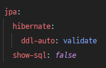

## 개요

안녕하세요 오늘은 JPA를 통해 RDB의 JSON 타입을 핸들링하는 방법을 알아보도록 하겠습니다.

**왜 RDB에서 JSON 타입을 사용하나요?**   
프로젝트가 비정형 데이터가 없을 거라 생각하고 처음부터 RDB를 선정하고 개발하고 있었습니다.   
그러다 일부 데이터를 모아서 다시 보여주는 기능이 있는데 그 기능이 유저가 사용하기에 따라 달라 비정형 데이터에 가까워서 이걸 RDB에 쉽게 정의해서 db에 넣기가 힘들었습니다.   
그래서 NOSQL을 추가해서 사용하기보단 RDB에 JSON 타입을 사용하기로 결정했고 해당 프로젝트는 JPA를 사용하고 있기에 JPA를 통해 RDB에 JSON 타입을 어떻게 사용하는지 알아 보고자 합니다.

### 환경

- JAVA 11
- SpringBoot 2.7.0
- [hibernate-type](https://github.com/vladmihalcea/hibernate-types)
- MariaDB 10.6.7

### Hibernate-Type이란?
Hibernate ORM에서 지원하지 않는 추가 유형 및 범용 유틸리티를 지원하는 라이브러리 입니다.   
해당 라이브러리를 통해 간단하게 RDB에 JSON 타입을 JPA로 핸들링이 가능합니다.

### 사용법

   
application.yml에서 jpa 설정은 위와 같이 지정하고 설명하겠습니다

**해당 라이브러리에서 JSON Type은 공식적으로 MySQL과 PostgreSQL 그리고 Oracle 3개만 지원하고 있습니다.**   
**해당 포스팅은 MaraiaDB 기준으로 설명하고 있습니다, 사용시 Hibernate 버전과 사용하는 DB를 체크하고 [hibernate-type](https://github.com/vladmihalcea/hibernate-types) 해당 라이브러리 README.md를 읽어주세요!!**
```java
@Getter
@NoArgsConstructor(access = AccessLevel.PROTECTED)
@AllArgsConstructor(access = AccessLevel.PRIVATE)
@Entity
@TypeDef(name = "json", typeClass = JsonType.class)
@Table(name = "user_histories")
public class UserHistory {
    
    @Id
    private Long id;
    
    @Type(type = "json")
    @Column(name = "histories", columnDefinition = "longtext")
    // MariaDB는 JSON 타입을 사용시 내부적으로 longtext 타입을 가집니다 그래서 columnDefinition을 longtext로 지정 해야 합니다 
    private Map<String, Object> history = new HashMap<>();
    
    public static UserHistory of(Map<String, Object> history) {
        return new UserHistory(null, history);
    }
}
```
위와 같이 Entity를 만들고

```json 
{
  "exercise": "boxing",
  "work": "develop service",
  "movie": "TopGun"
}
```
복싱을 하고 서비스 개발 일을 한 다음에 탑건 영화를 봤다는 json을 저장한다고 했을 때
```java
@RequiredArgsConstructor
@Service
public class UserHistoryService {
    
    private final UserHistoryRepository repository;
    
    @Transactional
    public void save(String exercise, String work, String movie) {
        var histories = Map.of(
                "exercise", exercise,
                "work", work,
                "movie", movie
        );
        
        var history = UserHistory.of(histories);
        repository.save(history);
    }
}
```
위와 같은 방식으로 데이터를 저장하면 됩니다.

아쉽게도 특정 key 값만 업데이트를 하거나
조회하는 기능은 없습니다.

그래서 특정 key 값을 반환 받고 싶으면 자바에서는 dto를 통해 반환해야 합니다. 
```java
var work =  history.get("work");

return Dto.from(work);
```

업데이트 같은 경우
```java
public void update(Map<String, Object> history) {
    this.history = history;
}
```
와 같이 통째로 업데이트 하는 방법 밖에 없습니다.

### 정리
JPA를 통해 RDB JSON 타입을 다루는 법을 알아 봤습니다.   
저는 종종 비정형 데이터가 아니어도 RDB에 JSON 타입을 종종 사용하고 있습니다.   
예를 들어 게시글에 사진이 들어간다고 했을 때 사진 업로드 개수가 제한이 있다면 게시글 테이블과 사진 테이블 2개를 만들어 연관관계를 맺기보단
게시글 테이블 안에 사진 칼럼을 JSON 타입으로 주어서 하나로 사용하고 있습니다.

나중에 JPA를 사용 중인데 JSON 타입을 사용할 일이 있다면
[hibernate-type](https://github.com/vladmihalcea/hibernate-types)을 사용해 보시는 건 어떠신가요?

---
참고:
- https://github.com/vladmihalcea/hibernate-types/issues/410
- https://velog.io/@dokkabei97/RDB%EC%97%90%EC%84%9C-JSON-%ED%83%80%EC%9E%85-%EC%82%AC%EC%9A%A9%EA%B8%B0